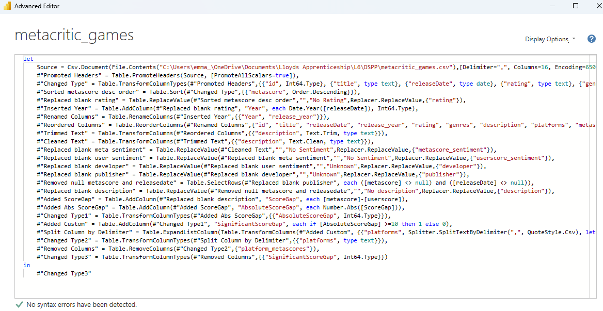

# My Portfolio 

## About Me
Hello, I am a Data Science student who loves solving complex problems using data and automation to optimise solutions. 
I am currently completing my Level 6 Data Science Degree/Apprenticeship.

### Education 
| Degree title | University | Year | Grade |
| --- | --- | --- | --- |
| BSc (hons) Psychology | Leeds Beckett University | 2015 - 2018 | 2:1 |
| MA Community Psychology | University of Brighton | 2018 - 2021 | Merit |
| PGCE Secondary Computing | Sheffield Hallam University | 2021 - 2022 | Distinction |
| Level 4 Data Analyst | Firebrand | 2024 - 2025 | Merit |

### Technical Skills
* Power BI
* Power Automate
* Project management
* Critical problem solving
* Automation & Optimisation

## Projects
Data Science Project aiming to understand the differences between Critic and User Reviews using Metacritic Data from Kaggle [https://www.kaggle.com/datasets/mohamedasak/metacritic-games-dataset]

### Executive summary

This project investigates video game review comparisons using Metacritic ratings. Significant differences were explored between the genre, platform and release year of a game to determine how users and critics differed in their ratings. Critics rated games higher on average, but when sentiment was involved, users rated higher. The biggest differences were with the ‘adventure’ genre, older consoles (Xbox, PS2), and in recent years the gap has widened between the groups. More investigation is needed for the reasoning behind these findings, but the visuals convey the significant differences across the features.  

### Data Source and Preparation

The Metacritic gaming data was sourced from Kaggle, which contained a collection of video game ratings from critics and users along with other metadata (Adel, 2026). Metascores (from the critics) are a weighted aggregated average of numerous critic reviews for that title, as some reviews are more detailed and carry more prestige (Metacritic support, 2024a). The CSV was loaded into Power BI where transformations took place using Power Query as this low-code solution is user friendly and intuitive (Microsoft, 2026b).

After initially investigating the data available, the hypothesis will test that a game’s characteristics, such as genre, platform and release year, influence the likelihood of a significant difference between critic and user review scores. 

#### Transformations:

The key transformations are listed below to ensure the data is clean and robust for using throughout the project.

The ‘platform’ column was transformed in two different ways by duplicating the dataset. The original column contained comma separated values and had duplicate platforms in different orders. Therefore, individual platforms were needed, along with how many platforms a game was available on (shown below respectively). 
 

The full list within Advanced Editor for the dataset with duplicate titles for gettign individual platforms:

