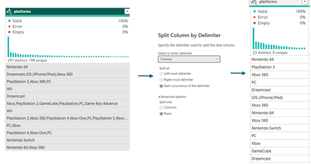
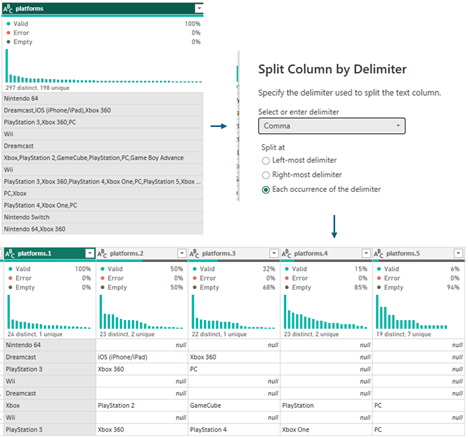
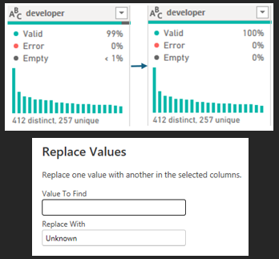

# My Portfolio 

## About Me
Hello, I am a Data Science student who loves solving complex problems using data and automation to optimise solutions. 
I am currently completing my Level 6 Data Science Degree/Apprenticeship.

### Education 
| Degree title | University | Year | Grade |
| --- | --- | --- | --- |
| BSc (hons) Psychology | Leeds Beckett University | 2015 - 2018 | 2:1 |
| MA Community Psychology | University of Brighton | 2018 - 2021 | Merit |
| PGCE Secondary Computing | Sheffield Hallam University | 2021 - 2022 | Distinction |
| Level 4 Data Analyst | Firebrand | 2024 - 2025 | Merit |

### Technical Skills
* Power BI
* Power Automate
* Project management
* Critical problem solving
* Automation & Optimisation

## Projects
Data Science Project aiming to understand the differences between Critic and User Reviews using Metacritic Data from [Kaggle](https://www.kaggle.com/datasets/mohamedasak/metacritic-games-dataset)

### Executive summary

This project investigates video game review comparisons using Metacritic ratings. Significant differences were explored between the genre, platform and release year of a game to determine how users and critics differed in their ratings. Critics rated games higher on average, but when sentiment was involved, users rated higher. The biggest differences were with the ‘adventure’ genre, older consoles (Xbox, PS2), and in recent years the gap has widened between the groups. More investigation is needed for the reasoning behind these findings, but the visuals convey the significant differences across the features.  

### Data Source and Preparation

The Metacritic gaming data was sourced from Kaggle, which contained a collection of video game ratings from critics and users along with other metadata (Adel, 2026). Metascores (from the critics) are a weighted aggregated average of numerous critic reviews for that title, as some reviews are more detailed and carry more prestige (Metacritic support, 2024a). The CSV was loaded into Power BI where transformations took place using Power Query as this low-code solution is user friendly and intuitive (Microsoft, 2026b).

After initially investigating the data available, the hypothesis will test that a game’s characteristics, such as genre, platform and release year, influence the likelihood of a significant difference between critic and user review scores. 

#### Transformations:

The key transformations are listed below to ensure the data is clean and robust for using throughout the project.

* The ‘platform’ column was transformed in two different ways by duplicating the dataset. The original column contained comma separated values and had duplicate platforms in different orders.

* Therefore, individual platforms were needed:  

 

* Along with how many platforms a game was available on:

* Missing values were replaced with 'Unknowns' for several columns:

*Removed nulls for Metascores and Release Date as using imputated values would introduce bias.

* Created Calculated Columns:

The full list within Advanced Editor for the dataset with duplicate titles for gettign individual platforms:

Initially, Python was used to show a distribution of score gaps. The second/third columns sat around a 10-point difference, indicating a more significant gap than the lower end. Due to the scale being from 0-100, a difference greater than 10% seemed reasonable (see Screenshot below). 
When calculating the ‘SignificantScoreGap’ column (end of Table 1), the ‘10’ from the histogram was used to create a binary column. Power BI came with the ease of creating and interpreting visuals that are dynamic and can give further insight than a static graph.  

[hist]

### Analysis and Visualisations

The analysis was conducted in Power BI due to the wide array of visuals available and the ability to explore patterns, trends and how the different features affected scores. The dynamic capabilities meant the user could drill down and see how statistics change. 

Initially, average comparisons were made between the scores of users and critics. The four features chosen to examine were ‘genre’, the number of platforms (‘platform category’), ‘release year’ and the individual ‘platforms’. Averages across the board were higher from critics regardless of the feature (Screenshot below). Critics scores had been on a steady incline since 2010, whereas users had more variation in the peaks and troughs of scores. There could be a multitude of reasons for that; the quality of games is getting better, but there’s also more games out there than before. 

There are some nuances where there is a more significant difference in the ‘adventure’ genre and games on ‘Xbox’; albeit this is a much older console which was released in 2001 (Hunter, 2026). Both critics and users will rate a game higher when available on more than four platforms potentially showing the breadth of the game and the availability of users to play and review.

[comp avg user scores]

Conceptually, modelling was done to see the percentage score gap between users and critics and where these were highest. The screenshot below confirms the percentage difference, whereas Screenshot 2 showed the average score differences. The top 10 genres were explored to see where the differences were for a higher number of players. As previously discussed, ‘adventure’ had a 46% difference between users and critics, this could be due to adventure covering a wide array of games and users having a different experience. Sentiment analysis investigated some of these differences later in the report. 

Point and click games, PlayStation 4 and games on multiple platforms had the lowest score gaps overall. However, the gap is widening again (above 40%) in later years suggesting more is at play, especially with a score gap of ~10 points between the two groups. IGN (no date), discussed how they reviewed games matching the person with expertise in that genre, want to experience games pushing boundaries and use a 10-point scale: 1 – unbearable, 5 – mediocre, 10 – masterpiece. However, not all critics will review the same so bias could occur.

[sig score gap

To investigate whether critics or users were reviewing higher, the direction of sentiment was calculated using DAX (Screenshot 4). The sentiments were included as part of the dataset and Metacritic Support (2024b) listed the grouped categories both critics and users use to review games (Screenshot 5). 

More often the same sentiment was found between the two groups, but Screenshot 6 highlights any differences in direction. Despite critics rating higher on average, when it came to sentiment differences, users rated games higher than critics overall (Screenshot 6). This occurred due to the large groupings where a score of 65 and 74 are both ‘mixed or average’ but the scores alone would show a larger difference. The top individual platforms with a high critic/user difference were PlayStation 2, DS and Xbox, where users had more positive experiences with these consoles. 

[sent diff]

### Recommendations

The investigation of user and critic differences in video game scoring has been enlightening. Various factors such as genres, platform, number of platforms and release year have shown different patterns of significant score differences. The score gap was rising in recent years, the ‘adventure’ genre portrayed high differences along with games on only one platform. 

In the future, the patterns conveyed could be drilled into further. For example, investigating PC as it stood out on Screenshot 6 and how it compared for the genres/ratings. Alternatively, games could be grouped into Indie, AA and AAA games to determine any significant differences in ratings. Games are categorised dependent on the budget, team and resources available. Indie games have much smaller team and budget, whereas AAA games have huge budgets and develop larger games (Inlingo, 2024).

The next steps would be to import the data into Python and investigate statistical significance of the results to determine if the percentage gap is as big as Power BI portrays (Screenshot 3) as there are limits to the statistical modelling Power BI can achieve that would be more suited to Python. However, due to time constraints Power BI was used to show conceptual modelling and how the features (genres, platform and release year) interacted with the scores. 
Scikit-learn could be used within Python to complete logistic regression by building a train/test model with the stated features and the significant score gap to determine accuracy, recall and precision scores of the model and adjust the parameters if needed. 

It’s important to remember that reviews are subjective and just because a game is reviewed with ‘Universal Acclaim’ (Screenshot 5) does not mean every player will enjoy it. Similarly, a game that is rated poorer does not mean players will dislike it, but there is more power in rating a game poorly and swaying players away from it. Critics could potentially have bias in some reviews such as monetary incentives, but there is an ethical need to be as fair as possible for the player. There is potential for further exploration with this data to know what factor affects review scores the most.  

### References
* Adel, M. (2026) Metacritic Games Dataset, Kaggle. Available at: https://www.kaggle.com/datasets/mohamedasak/metacritic-games-dataset (Accessed: March 16 2026).
* Hunter, N. (2026) ‘Every Xbox Console: A full history of release dates’ IGN, 9 February. Available at: https://www.ign.com/articles/all-xbox-console-release-dates-in-order (Accessed: 5 May 2026).  
* IGN (no date) Review Scoring. Available at: https://corp.ign.com/review-practices (Accessed: 5 May 2026).
* Inlingo (2024) ‘Indie, AAA vs. AA Games: What they are and what sets them apart’ Inlingo, 26 July. Available at: https://inlingogames.com/blog/indie-vs-aaa-vs-aa-games/ (Accessed: 6 May 2026).
* Metacritic Support (2024a). How do you compute METASCORES? Available at: https://metacritichelp.zendesk.com/hc/en-us/articles/14478499933079-How-do-you-compute-METASCORES (Accessed: 1 May 2026). 
* Metacritic Support (2024b). What’s with these green, yellow and red colors? Available at: https://metacritichelp.zendesk.com/hc/en-us/articles/15456077802647-What-s-with-these-green-yellow-and-red-colors (Accessed: 1 May 20206).
* Microsoft (2026b) What is Power Query? Available at: https://learn.microsoft.com/en-us/power-query/power-query-what-is-power-query (Accessed: 28 April 2026). 
