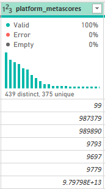
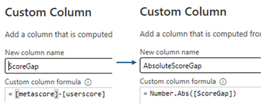
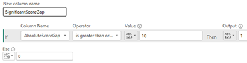
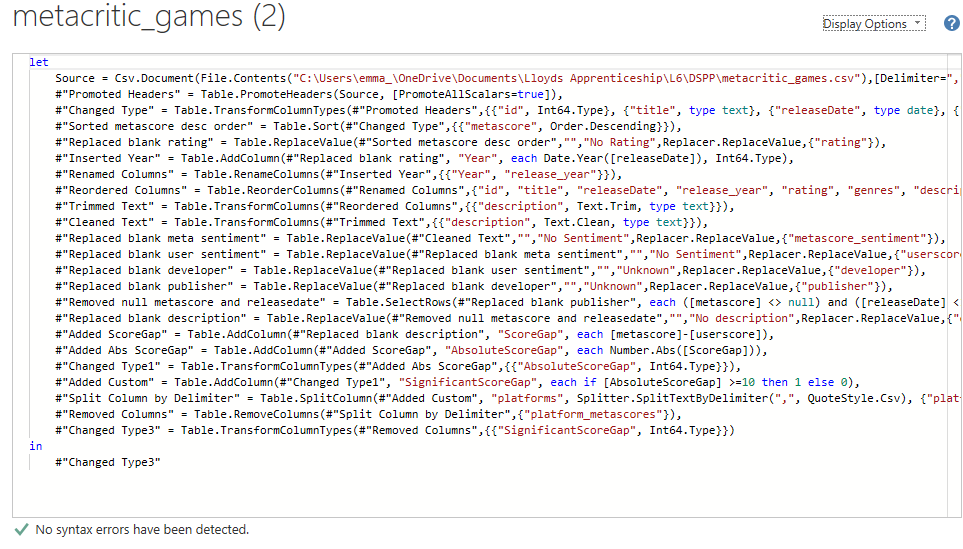
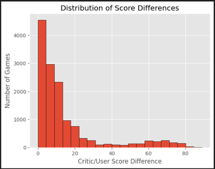
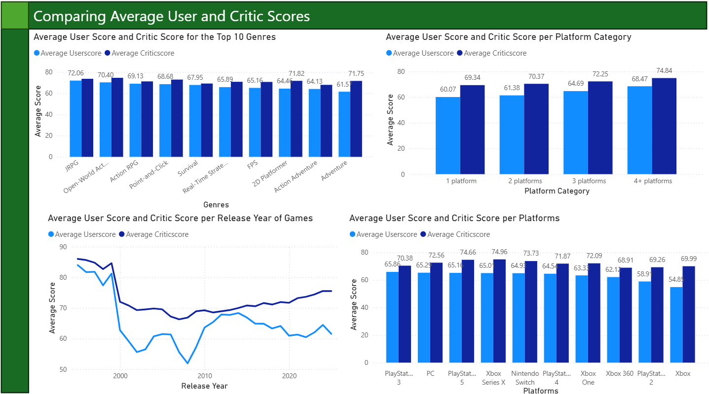
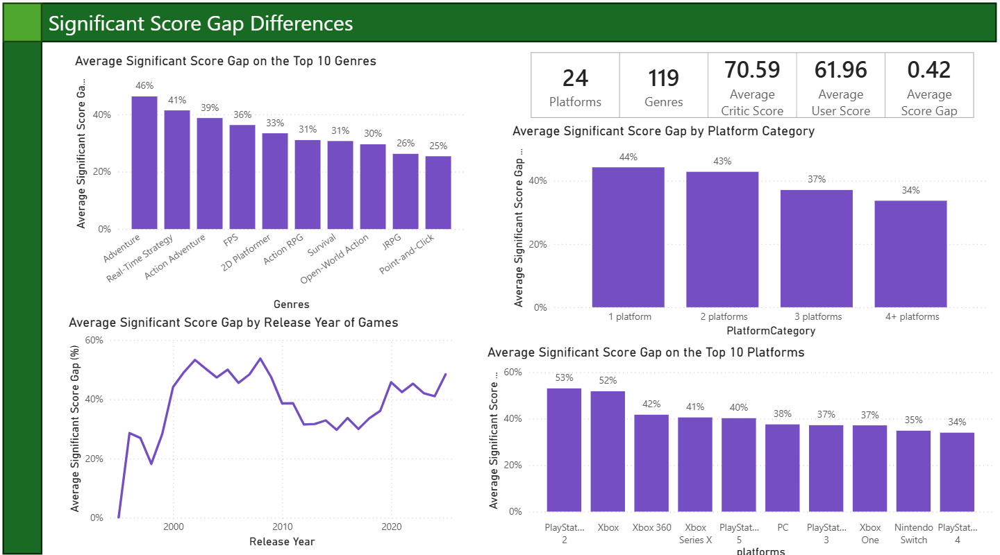
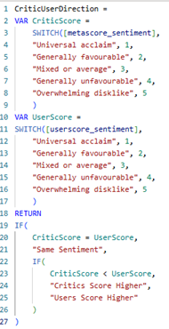
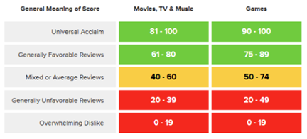
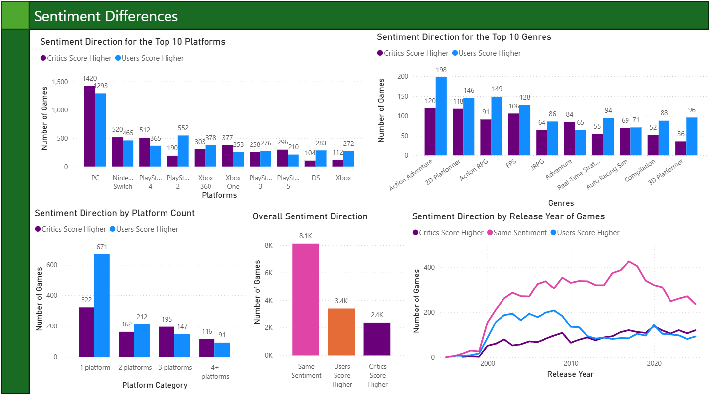

# My Portfolio 

## About Me
Hello, I am a Data Science student who loves solving complex problems using data and automation to optimise solutions. 
I am currently completing my Level 6 Data Science Degree/Apprenticeship.

### Education 
| Degree title | University | Year | Grade |
| --- | --- | --- | --- |
| BSc (hons) Psychology | Leeds Beckett University | 2015 - 2018 | 2:1 |
| MA Community Psychology | University of Brighton | 2018 - 2021 | Merit |
| PGCE Secondary Computing | Sheffield Hallam University | 2021 - 2022 | Distinction |
| Level 4 Data Analyst | Firebrand | 2024 - 2025 | Merit |

### Technical Skills
* Power BI
* Power Automate
* Project management
* Critical problem solving
* Automation & Optimisation

## Projects
Data Science Project aiming to understand the differences between Critic and User Reviews using Metacritic Data from [Kaggle](https://www.kaggle.com/datasets/mohamedasak/metacritic-games-dataset)

### Executive summary

This project investigates video game review comparisons using Metacritic ratings. Significant differences were explored between the genre, platform and release year of a game to determine how users and critics differed in their ratings. Critics rated games higher on average, but when sentiment was involved, users rated higher. The biggest differences were with the ‘adventure’ genre, older consoles (Xbox, PS2), and in recent years the gap has widened between the groups. More investigation is needed for the reasoning behind these findings, but the visuals convey the significant differences across the features.  

### Data Source and Preparation

The Metacritic gaming data was sourced from Kaggle, which contained a collection of video game ratings from critics and users along with other metadata (Adel, 2026). Metascores (from the critics) are a weighted aggregated average of numerous critic reviews for that title, as some reviews are more detailed and carry more prestige (Metacritic support, 2024a). The CSV was loaded into Power BI where transformations took place using Power Query as this low-code solution is user friendly and intuitive (Microsoft, 2026b).

Hypothesising that certain features of a game like genre, platform and release year could increase the likelihood of a significant score gap between critics and users rating the games. 

#### Transformations:

The key transformations are listed below to ensure the data is clean and robust for using throughout the project.

* The ‘platform’ column was transformed in two different ways by duplicating the dataset.
* This is because the original column contained multiple string entries such as "Xbox,PlayStation 4,PC" and "PC,Xbox,PlayStation 4" and would report as different entries despite having the same platforms.
* I split the column by comma separating values and did this in two different ways. One, I split into rows to separate out each platform to get the individual platforms as shown below: 

 

* And then I split the other data set into multiple columns to list each platform the game was availble on, this is shown below:

* I replaced missing values with 'Unknowns' for several columns such as description, publisher and rating as these were key columns to investigate and removing too many values would have skewed the data:

* I removed nulls for Metascores and Release Date as using imputated values such as the avergae would introduce bias as the scores and release years are specific data points. There were only one case of each, therefore this was simpler to remove from the dataset.
  

* One column Platfrom Metascores was presented as multiple scores together causing a formatting error. Due to not knowing which score belonged to which platform and it not being vital, this was removed:

* I created Calculated Columns such as the score gap by subtracting the user score from the critic score, then I added another column to make this number absolute - regardless of which way the score difference way, it needed to be positive:

* The full list within Advanced Editor for the dataset with duplicate titles for getting individual platforms:

* The full list within Advanced Editor for the dataset without duplicate titles for getting multiple platforms:

Initially, Python was used to show a distribution of score gaps. Afte examining the histogram, a siginficant difference appeared around the 10-point mark, indicating a more significant gap than the lower end. Due to the scale being from 0-100, a difference greater than 10% seemed reasonable (see Screenshot below). 
When calculating the ‘SignificantScoreGap’ column (end of Table 1), the ‘10’ from the histogram was used to create a binary column.  

### Analysis and Visualisations

The analysis was conducted in Power BI due to the wide array of visuals available and the ability to explore patterns, trends and how the different features affected scores.

I initially compared average scores between users and critics over four different features - genre, number of platfroms, release year and individual platforms. Overall critics rated all categories higher than users, with particular differences shown with games on 1 platform, the 'adventure' genre and reviews on Xbox - but this is an older console which was released in 2001 (Hunter, 2026) which perhaps could be excluded from the dataset to focus on more up-to-date consoles and games. But the changing trends and comparisons of older consoles could also be considered here. 
The scores for critics has increased over the years which could be due to more AAA games being released or the quality of games and number of games is higher than ever before. 

Both critics and users will give a game a higher score when it is cross-platform, reaching a wider audience to review and shows the resources available from the developer to publish on different platforms.

Conceptually, modelling was done to see the percentage score gap between users and critics and where these were highest. Percentage differences were investigated across significant score gaps - so this was only those games where the gap was wider than 10 points between users and critics. 
The 'adventure' genre had the highest differnce at 46% suggesting a large difference between the review groups. The reasons for this difference would need to be further investigated, but the genre as a whole is broad and could cover a wide-variety of games. Additionally, games are tagged with multiple genres, so a title could be assigned numerous genre. Further research into how the priamry genre is assigned to a game is needed. 

Point and click games, PlayStation 4 and games on multiple platforms had the lowest score gaps overall. This shows a wide range of features from different areas affect the score differences - there was still a signigicant gap between the groups, but these were the lowest of the top 10. 

The score gap is on an upward trend for recent years over 40% suggesting critics and users have different criteria for scoring their review. IGN (no date) detailed their review process as they try to match a person familair with te genre when reviewing the game, making it a more fair and balanced review. 
Games that receive higher scores from IGN are those pushing the boundaries and doing something new in the space. The scale for game ratings is between 1-10 where 1 – unbearable, 5 – mediocre, 10 – masterpiece. This is subjective still, despite the attempt at making the reviews objective. 
Some people speculate that some critics already have a base score when rating a game and add additional points for story, pushing boundaries etc, therefore bias could be present and scores need to be taken with some speculation. Additionally, Metacritic stated the score is a _weighted_ average where some have a larger sway in the overall score. 

To investigate whether critics or users were reviewing higher, the direction of sentiment was calculated using DAX (Screenshot below). This used the groupings from Metacritic Support (2024b) where critics and users use the same groups. The groupings are broad where the top games are within 10 points, and the average games have a 24 point range. 

More often the same sentiment was found between the two groups, but the Screenshot below highlights whether users or critics rated them higher. Despite critics rating higher on average, when it came to sentiment differences, users rated games higher than critics overall. As mentioned previously, the groups are very large for some categories like 'mixed or average' where a score of 55 and 72 are in the same category. But for a game that has 'Universal Acclaim' it needs to be 90 or above (100 = max). The graphs predominantly show where differences between the groups occur, with greatest gaps (users rating higher) occurred  in games on 1 platform, 'action adventure' genre, and '3D platform'. The trends over time are simialr for whether users or critics rate higher though.

### Recommendations

This investigation has been interesting and highlighted how much more research can be done into the area to see which factors impact the most. For example looking into individual platforms and seeing how the patterns alter. Alternatively, games could be grouped into Indie, AA and AAA games to determine any significant differences in ratings. Games are categorised dependent on the budget, team and resources available. Indie games have much smaller team and budget, whereas AAA games have huge budgets and develop larger games (Inlingo, 2024).

Looking into the statistical significance using Python would be what I'd do next to determien if the gaps are significant with the p value < 0.05. 
Scikit-learn could then be used within Python to complete logistic regression by building a train/test model with the stated features and the significant score gap to determine accuracy, recall and precision scores of the model and adjust the parameters if needed. 

The reviews are subjective and do not always determine whether you will enjoy or dislike a game. Lookign at genres you enjoy could be a better indicator, but not always. Exploring how critics do their reviews and whether any incentive is involved could be interesting, as most users will review when a game is either excellent or poor. Some users do have games gifted and as part of the exchange put a review on the platform. This is just the beginning of this research and more could be done in the future, 

### References
* Adel, M. (2026) Metacritic Games Dataset, Kaggle. Available at: https://www.kaggle.com/datasets/mohamedasak/metacritic-games-dataset (Accessed: March 16 2026).
* Hunter, N. (2026) ‘Every Xbox Console: A full history of release dates’ IGN, 9 February. Available at: https://www.ign.com/articles/all-xbox-console-release-dates-in-order (Accessed: 5 May 2026).  
* IGN (no date) Review Scoring. Available at: https://corp.ign.com/review-practices (Accessed: 5 May 2026).
* Inlingo (2024) ‘Indie, AAA vs. AA Games: What they are and what sets them apart’ Inlingo, 26 July. Available at: https://inlingogames.com/blog/indie-vs-aaa-vs-aa-games/ (Accessed: 6 May 2026).
* Metacritic Support (2024a). How do you compute METASCORES? Available at: https://metacritichelp.zendesk.com/hc/en-us/articles/14478499933079-How-do-you-compute-METASCORES (Accessed: 1 May 2026). 
* Metacritic Support (2024b). What’s with these green, yellow and red colors? Available at: https://metacritichelp.zendesk.com/hc/en-us/articles/15456077802647-What-s-with-these-green-yellow-and-red-colors (Accessed: 1 May 20206).
* Microsoft (2026b) What is Power Query? Available at: https://learn.microsoft.com/en-us/power-query/power-query-what-is-power-query (Accessed: 28 April 2026). 
